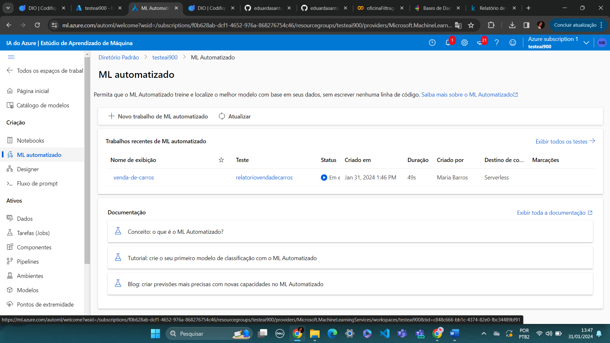
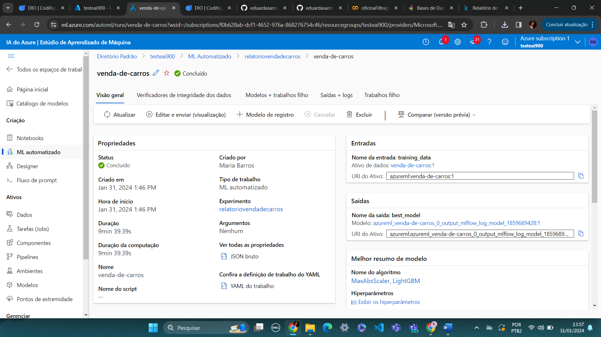
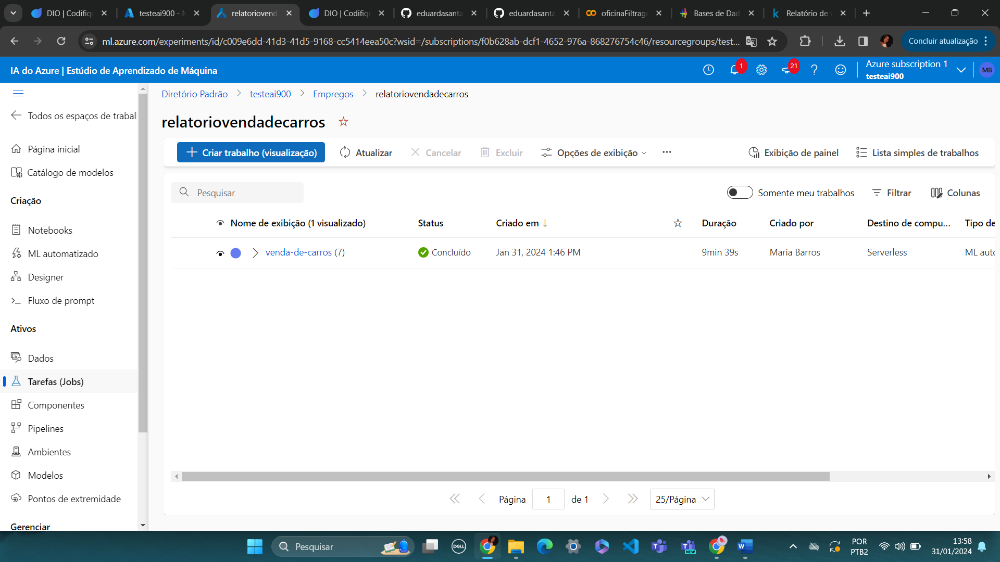
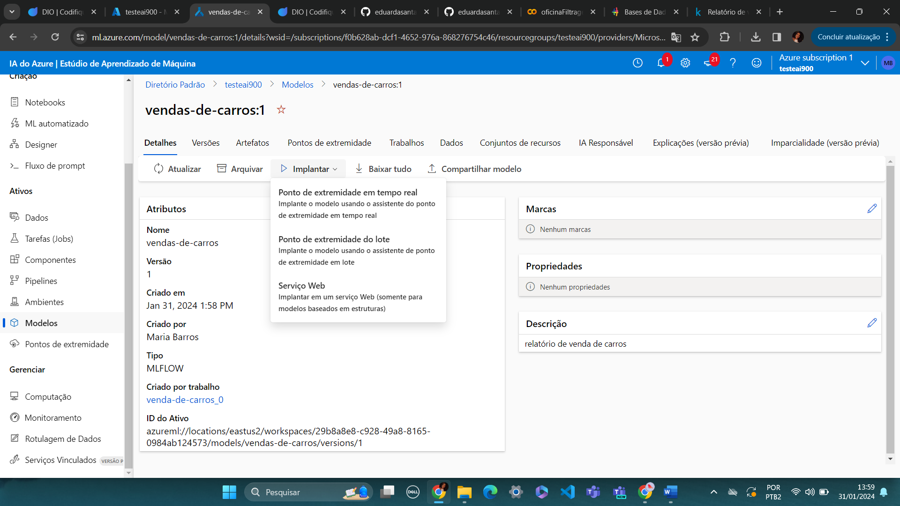
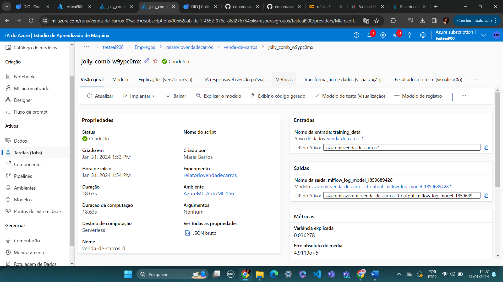
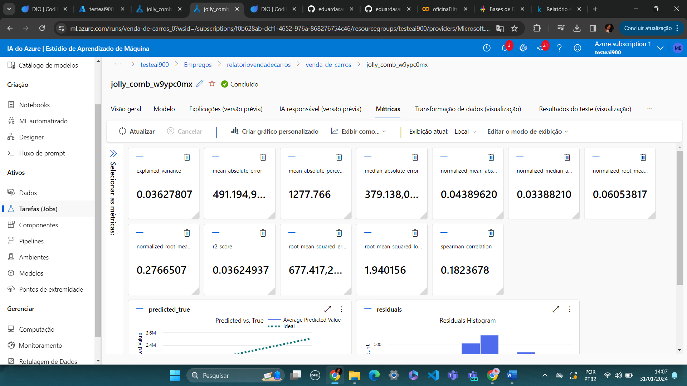
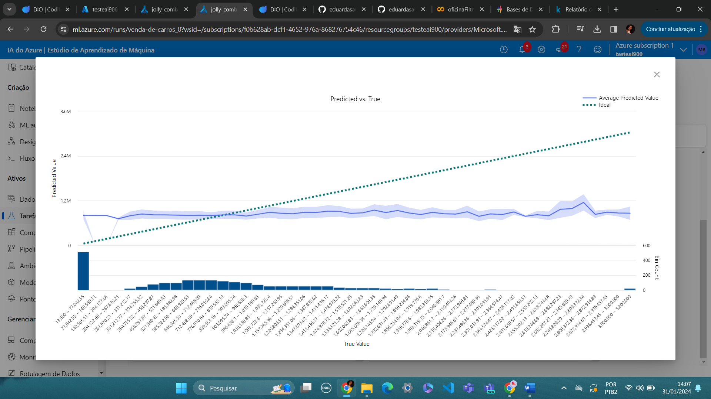
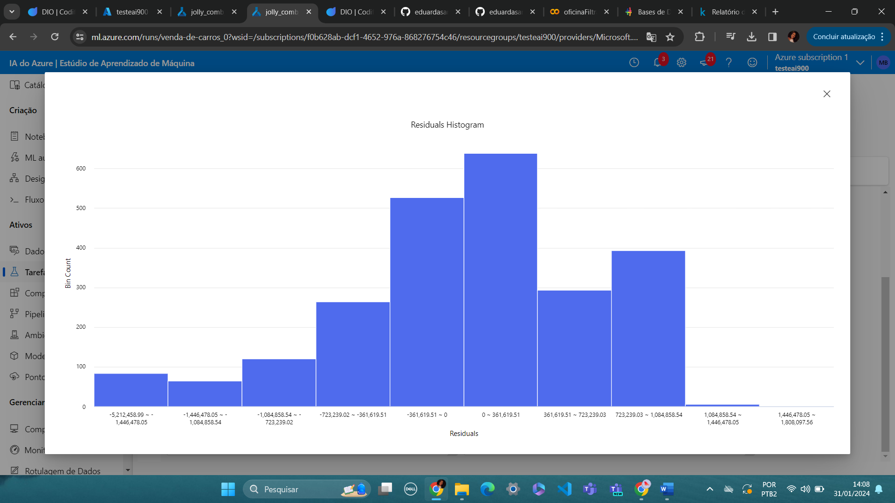
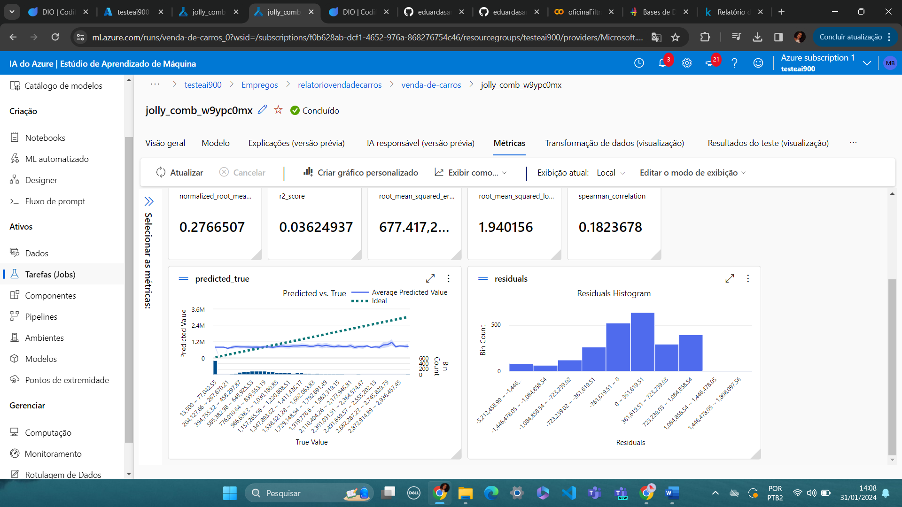
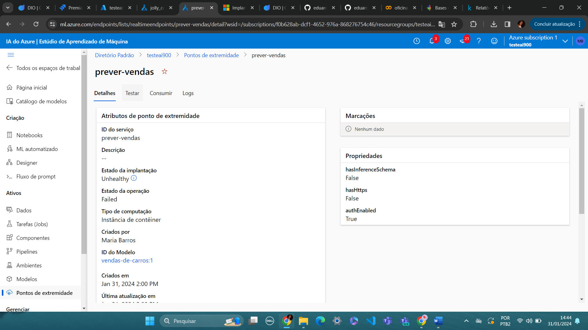

# Machine Learning com Azure ML

Primeiramente foi escolhida uma base de dados para trabalhar na execução da atividade, que tinha como objetivo 
criar um modelo de previsão com seus devidos pontos de extremidade configurados.

Este exercício contém o passo a passo do tratamento para a base de dados de um relatório de vendas de carros. 
Para isso foi utilizada a base de dados do Kaggle: https://www.kaggle.com/datasets/missionjee/car-sales-report?resource=download.

## Figura 1:
Após as configurações iniciais, que incluem a base de dados e registra o resource no ambiente Azure.

## Figura 2:
Indica que a base de dados foi incluida e configurada com sucesso.

## Figura 3:
Na aba Tarefas é possível identificar todos os processos realizados para a configuração.

## Figura 4:
Na aba Modelos é criado ou implantado um ponto de extremidade como serviço web.

## Figura 5:
Após a implantação do ponto de extremidade, já é possível identificar as métricas associadas ao modelo de regressão
estabelecido na análise desses dados.

## Figura 6:
Exibição inicial das métricas.

## Figura 7:
Representação gráfica das métricas de predicted_true.

## Figura 8:
Representação gráfica das métricas de residuals.

## Figura 9:
Visão geral das métricas.

## Figura 10:
A aplicação apresentou falhas quanto aos testes a partir do ponto de extremidade,
classificando-o com estado de implantação "unhealthy".

